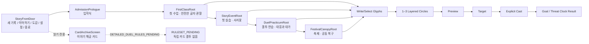

# GRIMOIRE — 스토리 아크 블루프린트·화면 계약 설계

```yaml
design_id: GR-STORY-ARC-BLUEPRINT-01
status: USER_SCOPE_APPROVED__FIRST_SESSION_RUNTIME_IMPLEMENTED__MACHINE_VERIFIED__EDITOR_RUNTIME_OBSERVED__HUMAN_NOT_RUN
decision_dependency: GM-CIRCLE-CLOCK-CARD-CORE-01
scope: admission_to_lesson_practicum_duel_festival
platform: mobile_first__landscape_fixed
planning_input: docs/planning/benchmarks/2026-09-01-story-led-academy-reverse-engineering.md
implementation_plan: docs/superpowers/plans/2026-09-01-story-arc-blueprint-implementation.md
runtime_receipt: docs/validation/STORY_ARC_FIRST_SESSION_RUNTIME_RECEIPT_2026-09-01.md
human_pdf_derivative: output/pdf/GRIMOIRE_STORY_ARC_BLUEPRINT_2026-09-02.pdf
human_pdf_manifest: output/pdf/GRIMOIRE_STORY_ARC_BLUEPRINT_2026-09-02.manifest.json
```

## 1. 플레이어 약속과 경계

플레이어는 마법학교의 학생으로서, **글자를 허공에 직접 새기고, 1–3개의 역할 없는 겹서클을 만들고, 대상과 대가를 확인한 뒤 명시적으로 시전**한다. 배운 글자의 의미는 같은 이야기 속 수업·실습·결투·축제에서 반복되며, 사건 시계는 시간이 지나며 누적되는 위험과 플레이어가 해소한 진전을 함께 보여준다.

```text
WRITE_OR_SELECT_GLYPHS_TO_LAYERED_CIRCLES_TO_TARGET_TO_EXPLICIT_CAST_TO_CLOCK_RESULT
```

온실과 묘목은 **첫 실습 사건**이다. 메인 내용이 아니다. 메인 화면은 활동 선택 허브가 아니라 이야기를 시작하거나 이어 가는 입구다.

### 이번 범위에 포함

- 입학식 → 첫 수업 → 첫 실습 → 결투 연습 → 축제의 스토리 플로우
- 각 장면의 상태·정보 우선순위·와이어프레임·Godot 소비처 제안
- 사건 시계와 겹서클의 공통 상태 계약
- 카드 아카이브의 이야기 소유·표현 경계
- 결투 연습 환경 이미지 후보 02의 provenance와 최종 잠금 경계
- 실제 소비처와 권리 preflight를 통과한 필요한 이미지 후보는 별도 승인 대기 없이 `BRIEF_READY → GENERATED_CANDIDATE → QA_AND_RECORD`까지 제작한다. 단, final lock, runtime binding, production batch, Human/Device/Release 증거는 각각 별도 상태로 남긴다.

### 명시적으로 제외

- 카드 상세 룰, 턴/라운드/승패, 마력 소비, 7·7·6 및 20의 수치 확정 (`RULESET_PENDING`)
- 카드 게임의 독립 실행 버튼, 카드 artwork 배치, 카드 배틀 구현
- 새 캐릭터 이름·관계·기숙사·로맨스·경제·스탯 확정
- 사용자 final lock이 없는 새 후보 이미지를 runtime에 바인드하거나 출시 자산으로 승격
- 사람·기기·접근성·성능·export·full slice PASS 선언

## 2. 현재 구현과 목표의 분리

| 영역 | 현재 상태 | 실제 owner/consumer | 이번 블루프린트의 처리 |
| --- | --- | --- | --- |
| 시작 화면 | 구현됨 / `IMPLEMENTED` | `StoryFrontDoor` / `story_front_door.tscn` | 새 기록·이어하기·도감·설정·종료를 유지한다. 활동 선택 버튼은 추가하지 않는다. |
| 입학식 | 구현됨 / `IMPLEMENTED` | `AdmissionPrologue` / `admission_prologue.tscn` | 짧은 약속 장면으로 유지하고, 목표 플로우에서는 수업으로 넘긴다. |
| 첫 사건 | 구현됨 / `IMPLEMENTED` | `StoryEventRoot` / `story_event_root.tscn` | 현재 서리꽃 실습의 글자·Preview·대상·시전·시계를 재사용한다. 목표 플로우에서는 수업 이후의 첫 실습이다. |
| 공용 사건 시계 | 구현됨 / `IMPLEMENTED` | `EventClockState`, `EventClockResolver`, `EventClockView` | Goal/Threat를 라이브 UI로 유지한다. 배경에 숫자를 구워 넣지 않는다. |
| 카드 기록 | 구현됨 / `IMPLEMENTED` | `CardArchiveScreen` | 이야기 해금 카드만 보여 주고, `RULESET_PENDING` 동안 결투 시작을 막는다. |
| 첫 수업 | 구현됨 / `IMPLEMENTED__MACHINE_VERIFIED__EDITOR_RUNTIME_OBSERVED` | `FirstClassRoot` / `first_class_root.tscn` | 직접 글자 쓰기의 안전한 첫 성공을 실제 스토리 순서에 둔다. |
| 결투 연습 | 구현됨 / `IMPLEMENTED__MACHINE_VERIFIED__EDITOR_RUNTIME_OBSERVED` | `DuelPracticumRoot` / `duel_practicum_root.tscn` | 학생끼리 대응을 배우는 비살상 사건 시계 장면을 실제 스토리 순서에 둔다. |
| 축제 | 구현됨 / `IMPLEMENTED__MACHINE_VERIFIED__EDITOR_RUNTIME_OBSERVED` | `FestivalCanopyRoot` / `festival_canopy_root.tscn` | 여러 유효한 돌봄의 표현을 비전투로 마무리한다. |

## 3. 전체 플로우맵



### 장면별 플레이어 감정선

| 비트 | 첫 3초에 알아야 할 것 | 핵심 판단 | 결과가 남기는 것 |
| --- | --- | --- | --- |
| 입학식 | 여기는 마법을 먼저 읽고 책임 있게 쓰는 학교다. | 다음 수업으로 갈 준비 | 이야기의 약속 |
| 첫 수업 | 안전한 물길이 글자에 반응한다. | 획을 정확히 쓰고 반응을 관찰 | 글자의 의미 |
| 첫 실습 | 묘목과 온실 구조물 모두 보호할 가치가 있다. | Preview 뒤 어떤 대상을 먼저 도울지 | 진전·위협의 인과 |
| 결투 연습 | 상대는 적이 아니라 같이 배우는 학생이다. | 상대의 의도와 위험을 읽고 대응 | 대가 없는 승리가 아닌 안전한 복기 |
| 축제 | 학교 전체가 배운 마법을 함께 사용한다. | 한 가지 정답 대신 여러 표현 중 하나를 고른다. | 공동체·다음 장의 약속 |

## 4. 네 기준 화면 와이어프레임

### SCREEN-01 — 스토리 프런트 도어 (구현됨)

```text
┌──────────────────────────────────────────────────────────────────────┐
│           [환경 전용 입학 전경]  ← live logo/title                   │
│                                                                      │
│                       GRIMOIRE                                      │
│                                                                      │
│              [새 기록 시작]                                          │
│              [이야기 이어하기 / 유효 기록 없으면 disabled]           │
│              [도감] [설정] [종료]                                    │
│                                                                      │
│  장식용 빈 좌/우 창 없음 · 수업/실습/결투/축제 직접 선택 없음         │
└──────────────────────────────────────────────────────────────────────┘
```

### SCREEN-02 — 공용 스토리 사건 (첫 수업·첫 실습·결투 연습·축제에서 구현됨)

```text
┌──────────────────────────────────────────────────────────────────────┐
│ [장면 제목] [짧은 상황 문장]                           [Goal ○○○○○○] │
│                                                       [Threat ○○○○]  │
│                                                                      │
│  [환경 배경: 글자·숫자 없음]    [상태 대상/대화 초상/상황 레이어]      │
│                                                                      │
│  [직접 글자 쓰기]  → [겹서클/Preview] → [대상 지정] → [시전]         │
│                                                                      │
│  live 피드백: "무엇이 변했는가" · 취소/조건 부족/중복 시전 방어      │
└──────────────────────────────────────────────────────────────────────┘
```

### SCREEN-03 — 마도 카드 기록 (구현됨, 카드 룰 보류)

```text
┌──────────────────────────────────────────────────────────────────────┐
│ 마도 카드 기록                                                       │
│ 카드 결투 상세 규칙: RULESET_PENDING                                │
│ 이야기가 해금한 카드만 기록합니다.                                   │
│                                                                      │
│ [카드 frame/분류/글자 조합] [카드 frame/분류/글자 조합]               │
│                                                                      │
│  독립 결투 시작 버튼 없음 · 이름/비용/수치/희귀도는 라이브 UI         │
│                         [메인 화면으로]                              │
└──────────────────────────────────────────────────────────────────────┘
```

### SCREEN-04 — 사건 결과·복기 (구현됨)

```text
┌──────────────────────────────────────────────────────────────────────┐
│ [장면 결과 제목]                                                    │
│ Goal: 바뀐 칸과 원인              Threat: 남은/해소된 칸과 원인       │
│                                                                      │
│ [대상 변화]     [학생/교수 한 줄 복기]     [새 기록/해금 카드]       │
│                                                                      │
│ [다음 이야기로]  ← 결과 재시전/자동 보상/정답 판정 없음              │
└──────────────────────────────────────────────────────────────────────┘
```

## 5. P0/P1 상황 계약

| ID | 상황 | 우선 | 진입/이탈 | 서클·시계 이용 | asset 상태 |
| --- | --- | --- | --- | --- | --- |
| SIT-001 | 입학식 | P0 | 새 기록 → 첫 수업 | 시계 없음; 약속 전달 | 입학 전경 `IMPLEMENTED` |
| SIT-002 | 첫 수업 | P0 | 입학식 → 첫 실습 | 안전한 Goal만; 실패가 파국이 되지 않는 관찰 | 수업 장면 `IMPLEMENTED`; planning reference는 방향 검수용 |
| SIT-003 | 첫 실습 | P0 | 첫 수업 → 결투 연습 | Goal/Threat 동시, 명시 Preview/Target/Cast | 기존 첫 사건 `IMPLEMENTED`; 온실 레퍼런스 재사용 |
| SIT-004 | 결투 연습 | P1 | 실습 복기 → 축제 | 상대 의도 파악 Goal, 과한 대응/연습장 불안정 Threat | 환경 02 `USER_APPROVED__CANON_REGISTERED__IMPLEMENTED__RUNTIME_BOUND` |
| SIT-005 | 축제 | P1 | 결투 복기 → 다음 장 | 공동 복구 Goal, 준비 지연 Threat; 비전투 | 축제 장면 `IMPLEMENTED`; planning reference는 방향 검수용 |

### 결투 연습의 최소 사건 정의

결투는 카드 게임이 아니다. 학생 두 명이 마법사로 살아가는 법을 배우는 **서클·시계 사건**이다. 결투 장면은 다음을 지킨다.

- 다른 학생은 처치 대상이나 몬스터가 아니다.
- `Goal`: 상대의 시전 의도를 읽고 안전한 대응을 완성한다.
- `Threat`: 연습장 안전 결계가 흔들리거나 불필요한 힘이 누적된다.
- 성공과 위협 증가는 동시에 가능하며, 성공 자체를 지우지 않는다.
- 화면의 대상과 예측은 라이브 UI가 소유한다. 환경 후보에는 효과·글자·원·수치가 없다.

## 6. Godot 구조와 상태 계약 (실제 구현)

```text
StoryProgress (authoritative story beat + card unlocks)
  ├─ AdmissionPrologue
  ├─ FirstClassRoot
  ├─ StoryEventRoot (first practicum)
  ├─ DuelPracticumRoot
  └─ FestivalCanopyRoot

Shared existing core
  CircleComposition + CircleCompositionResolver
  EventClockState + EventClockResolver + EventClockView
  CircleGlyphWritingPanel
  ThemeFactory
```

- Scene은 서사 비트별로 전환한다. 반복 가능한 글자 쓰기·시계·결과 패널은 재사용 UI Scene으로 둔다.
- `StoryProgress`만 다음 장면·카드 해금을 바꾼다. UI 노드 참조·이미지 경로·EventClock Node는 저장하지 않는다.
- Goal/Threat 변화와 결과 receipt는 이벤트 resolver가 소유하고, Animation/Tween 완료는 진행·보상·저장의 권위가 아니다.
- 빠른 연타, 장면 전환 중 입력, 이미 처리한 action id, 조건 부족, 취소, 저장 재진입은 기존 explicit-cast/idempotency 경계를 유지한다.

## 7. 시각·UI 제작 보드

| 필요 화면 | 먼저 재사용할 것 | 새 제작/상태 | 실제 소비처 | 최종 잠금 전 상태 |
| --- | --- | --- | --- | --- |
| 시작 | `bg_school_admission_approach.png` | 없음 | `StoryFrontDoor/EnvironmentBackground` | `IMPLEMENTED` |
| 수업 | `bg_school_common.webp` + class direct-glyph planning reference | 실제 장면은 텍스트·글자·UI를 배경 위 live layer로 둔다 | `FirstClassRoot/EnvironmentBackground` | `IMPLEMENTED`; reference는 planning only |
| 실습 | first guided greenhouse reference + 현재 EventClock UI | 기존 사건 화면의 실제 레이어 확인 | `StoryEventRoot` | current runtime + reference |
| 결투 | canonical cloister 02 | 환경만; 대상/글자/UI는 별도 라이브 레이어 | `DuelPracticumRoot/EnvironmentBackground` | `USER_APPROVED__CANON_REGISTERED__IMPLEMENTED__RUNTIME_BOUND` |
| 축제 | `bg_school_common.webp` + festival light-thread canopy reference | 실제 장면은 live state를 우선하고 festival 전용 새 raster는 소비처 확정 때만 후보 제작 | `FestivalCanopyRoot/EnvironmentBackground` | `IMPLEMENTED`; reference는 planning only |
| 카드 | `GR-VIS-025` card-frame brief | frame normal/locked/selected/disabled; wizard art는 보류 | `CardArchiveScreen` | `BRIEF_READY` |

환경과 기능 텍스트는 항상 분리한다. 캐릭터가 필요한 후속 후보는 **학생 느낌의 상반신 일러스트만** 만들며, SD 이동 캐릭터는 별도 보류다.

## 8. 검증·적대적 검토 기준

- 정적: StoryProgress의 이야기가 활동 선택 허브로 퇴행하지 않는지, 카드 상세 룰이 `RULESET_PENDING`을 벗어나지 않는지, 후보 파일/manifest SHA가 맞는지 검증한다.
- Godot: 1280×720 editor-runtime 관찰은 완료했다. 1920×1080, 실제 사람·기기·접근성·성능·export는 아직 실행하지 않았다.
- 후보 이미지: 필요한 후보는 consumer·권리·레이어 preflight 뒤 별도 승인 대기 없이 생성·검수 기록할 수 있다. final lock 전에는 Scene import/bind를 하지 않으며, lock된 02처럼 바인드할 때만 텍스트 없는 배경을 `MOUSE_FILTER_IGNORE`로 두고 별도 runtime crop 검증을 수행한다.
- Human/Device/Accessibility/Performance/Export: 이 설계와 후보 생성만으로는 `NOT_RUN`이다.

## 9. 현재 완료 상태·다음 단계

입학식 → 첫 수업 → 첫 실습 → 결투 연습 → 축제의 첫 세션 route와 결투 환경 02는 구현·자동 검증·1280×720 editor-runtime 관찰까지 완료됐다. 이 문서는 사람이 빠르게 확인할 수 있도록 같은 내용을 파생 PDF로도 제공하지만, Markdown 원본이 정본이며 PDF의 source SHA·render evidence는 manifest가 소유한다.

다음 안전 작업은 1920×1080 crop, 실제 Human/Device/Accessibility/Performance/Export 검증을 별도 증거로 수집하는 일이다. 카드 상세 규칙·턴·마력·승패는 계속 `RULESET_PENDING`이며, 새 카드 artwork·festival 전용 배경처럼 실제 소비처가 생긴 이미지는 위 후보 정책으로 준비하되 제품 의미·final lock과 runtime binding을 자동으로 확정하지 않는다.
